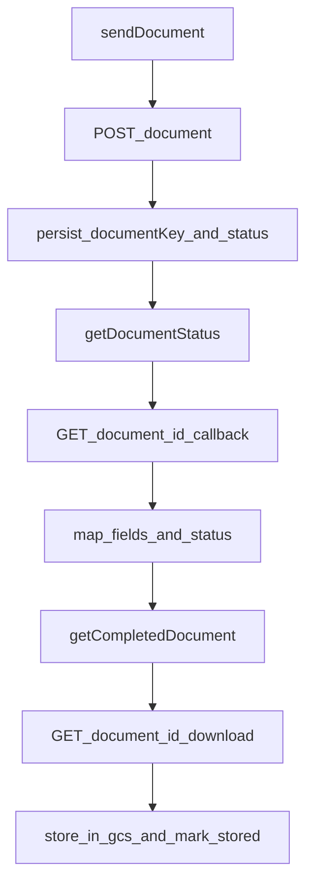

# DMS COMMON GowSign Client

---
title: DMS-COMMON GowSign Client
---
## Provider Dispatch Model

`EsignDocumentService` in `dms-common` persists `EsignDocument` and routes provider calls by enum:

- `EsignRouter.getClient(EsignClientEnum.GOWSIGN)` -> `GowSignClient`

References:

- `BE/dms-common/src/main/java/com/uownleasing/dms/common/service/EsignDocumentService.java`
- `BE/dms-common/src/main/java/com/uownleasing/dms/common/esign/EsignRouter.java`

## Create Document (`sendDocument`)

`GowSignClient.sendDocument(...)`:

- builds headers (`Content-Type`, `Accept`, `x-api-key`)
- calls `POST {baseUrl}/document`
- stores request/response metadata on `EsignDocument`
- maps response `data.id` to internal `documentKey`
- maps response `data.url` to `embedURLSentForSigning`
- updates status lifecycle (`SENT_TO_ESIGN_CLIENT` -> `SENT_TO_CUSTOMER`)

## Status Polling (`getDocumentStatus`)

`GowSignClient.getDocumentStatus(...)`:

- avoids remote polling if status is already terminal
- calls `GET {baseUrl}/document/{documentId}/callback`
- maps provider status to internal `EsignStatus`
- parses callback `fields` into `EsignField`
- persists updated fields/status

Field mapping includes:

- id (`api_id`, fallbacks supported)
- value normalization (booleans map to `"t"` / `"f"`)
- page/x/y coordinates
- field type normalization (`CHECKBOX`, `SIGNATURE`, `INITIALS`, etc.)

## Completed Document Retrieval (`getCompletedDocument`)

`GowSignClient.getCompletedDocument(...)`:

- calls `GET {baseUrl}/document/{documentId}` to resolve status-compatible PDF URL
- chooses source URL based on status (`createdPdfUrl` or `signedPdfUrl`)
- optionally maps `fieldValues`/`fields`
- downloads binary PDF via `GET {baseUrl}/document/{documentId}/download`
- stores base64 signed content and uploads to GCS
- marks status `STORED` after upload success

## Cancel Flow

`GowSignClient.cancelDocument(...)`:

- calls `DELETE {baseUrl}/document/{documentId}`
- maps successful result to `CANCELLED`
- maps failure cases to `UNKNOWN` or `ERROR` with persisted diagnostics

## Internal Flow Diagram

## Status Normalization (Provider -> Internal)

Implemented in `GowSignClient.mapGowStatus(...)`:

- `CREATED`, `OUTSTANDING` -> `SENT_TO_CUSTOMER`
- `SIGNED` -> `SIGNED`
- `COMPLETED` -> `COMPLETED`
- `EXPIRED` -> `EXPIRED`
- `CANCELED` -> `CANCELLED`
- default/unknown -> `UNKNOWN`
