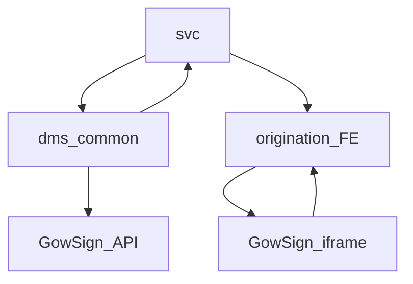

# Overview and Architecture

---
title: Overview and Architecture
---
## Scope

This documentation set describes the current GowSign integration used by UOWN for lease e-sign flows across:

- `svc` (routing, orchestration, payload construction)
- `dms-common` (provider client abstraction and persistence lifecycle)
- `origination` (embedded signing user experience)

Current implementation scope is centered on lease document flows where backend routing selects GowSign when eligibility criteria are met.

## Core Terms

- `esignClient`: Runtime provider identifier returned to frontend (`GOWSIGN` or `SIGNWELL`).
- `embeddedSigningUrl`: Provider signing URL used by embedded iframe/modal experience.
- `uown_gow_sign_template`: Registry table that maps state/clientType to GowSign Strapi template metadata.
- `GowSignCreateRequest`: Outbound provider payload generated in `svc` and sent via `dms-common`.
- `EsignStatus`: Internal provider-agnostic e-sign status lifecycle stored in `uown_esign_document`.

## Module Responsibilities

### `svc`

- Decides whether the request routes to GowSign.
- Selects template by state and client type.
- Builds scalar and table variables for template rendering.
- Dispatches provider request to `dms-common`.

Primary references:

- `BE/svc/src/main/java/com/uownleasing/svc/service/esign/EsignService.java`
- `BE/svc/src/main/java/com/uownleasing/svc/service/gowsign/DocumentOrchestrator.java`
- `BE/svc/src/main/java/com/uownleasing/svc/service/gowsign/DocumentDispatchService.java`

### `dms-common`

- Persists outgoing `EsignDocument`.
- Routes by `EsignClientEnum` to the proper provider client implementation.
- Executes create/status/completed/cancel provider calls for GowSign.
- Maps provider field payloads into internal `EsignField` format.

Primary references:

- `BE/dms-common/src/main/java/com/uownleasing/dms/common/service/EsignDocumentService.java`
- `BE/dms-common/src/main/java/com/uownleasing/dms/common/esign/EsignRouter.java`
- `BE/dms-common/src/main/java/com/uownleasing/dms/common/esign/gowsign/GowSignClient.java`

### `origination`

- Resolves provider from submit response.
- Opens GowSign modal with iframe for embedded signing.
- Enforces postMessage origin validation and event mapping.
- Triggers redirect flow on terminal signing events.

Primary references:

- `FE/origination/lib/esign/EsignSigningHost.tsx`
- `FE/origination/lib/esign/gowsign/GowSignEmbeddedSigningModal.tsx`
- `FE/origination/lib/esign/gowsign/parseGowSignPostMessage.ts`

## High-Level Architecture

## Runtime Summary

1. `svc` receives a lease e-sign request and decides provider route.
2. For GowSign route, `svc` builds `GowSignCreateRequest` and sends through `dms-common`.
3. `dms-common` calls GowSign API and persists document key/status.
4. `origination` opens the embedded URL and reacts to iframe events.
5. Status polling and completed-document retrieval update internal records until stored.
