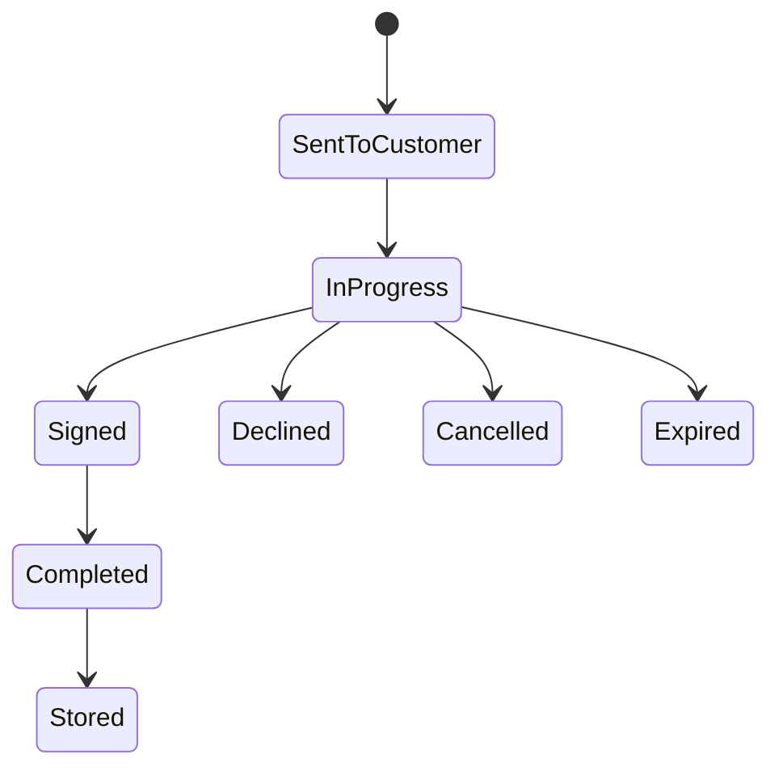

# end to end lifecycle and status mapping

---
title: End-to-end Lifecycle and Status Mapping
---
## End-to-End Happy Path

1. `svc` receives lease e-sign request.
2. Routing selects GowSign based on lease + template eligibility.
3. `DocumentOrchestrator` selects template and builds variables.
4. `dms-common` creates provider document and stores `documentKey`.
5. `origination` opens embedded signing URL in iframe modal.
6. Provider events drive redirect/state transitions.
7. Polling updates internal status and stores callback fields.
8. Completed-document flow downloads signed PDF and stores in GCS.
9. Contract status reflects final mapped e-sign status.

## Branches and Terminal Outcomes

- `completed` / `signed` path: document progresses to stored state and contract is signed.
- `closed` / decline-like path: flow exits without signed completion.
- `error` path: internal status becomes error and requires investigation.
- `cancel` path: provider/local status transitions to cancelled.
- `expired` path: contract status maps to expired.

## Status Mapping Layers

### GowSign Provider -> Internal `EsignStatus`

Implemented in `GowSignClient.mapGowStatus(...)`:

- `CREATED`, `OUTSTANDING` -> `SENT_TO_CUSTOMER`
- `SIGNED` -> `SIGNED`
- `COMPLETED` -> `COMPLETED`
- `EXPIRED` -> `EXPIRED`
- `CANCELED` -> `CANCELLED`
- fallback -> `UNKNOWN`

### Internal `EsignStatus` -> Contract Status

Implemented in `EsignService.getContractStatusFromEsignStatus(...)`:

- sent-like statuses -> `ContractStatus.SENT`
- `COMPLETED`, `SIGNED`, `STORED` -> `ContractStatus.SIGNED`
- `CANCELLED` -> `ContractStatus.CANCELLED`
- `EXPIRED` -> `ContractStatus.EXPIRED`
- unknown/error/declined -> `ContractStatus.ERROR`

## Persistence Checkpoints

Primary persistence and lifecycle checkpoints:

- `uown_esign_document` (provider request/response/status/document key)
- e-sign field snapshots from callback payload
- signed PDF base64 + uploaded object in GCS
- contract status updates in `svc` sweep/status refresh paths

## Lifecycle Diagram

