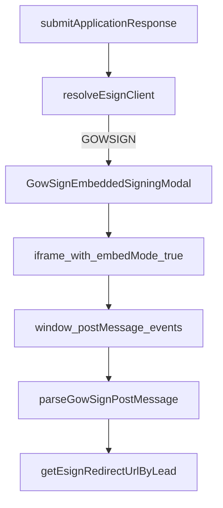

# origination embedded signing

---
title: Origination Embedded Signing
---
## Provider Resolution

`origination` determines e-sign provider from submit response:

- `submitApplicationResponse.esignClient`
- valid values: `GOWSIGN`, `SIGNWELL`

Reference:

- `FE/origination/lib/esign/resolveEsignClient.ts`
- `FE/origination/models/submit-application-response.ts`

## Host Component Behavior

`EsignSigningHost`:

- resolves provider
- opens GowSign modal for `GOWSIGN`
- opens SignWell embedded flow for `SIGNWELL`

Reference:

- `FE/origination/lib/esign/EsignSigningHost.tsx`

## GowSign Modal + Iframe

`GowSignEmbeddedSigningModal`:

- computes expected origin from `esignIframeOrigin` or embedded URL origin
- appends `embedMode=true` if missing
- renders iframe inside modal
- listens for postMessage actions and triggers redirect callbacks

References:

- `FE/origination/lib/esign/gowsign/GowSignEmbeddedSigningModal.tsx`
- `FE/origination/lib/esign/gowsign/buildIframeSrc.ts`

## PostMessage Event Handling

`parseGowSignPostMessage(...)` maps event types:

- `completed` -> completed action
- `closed` -> closed action
- `error` -> error action
- `close-iframe` -> close modal UI
- `loaded` and unknown events -> no-op

Listener hook:

- `useGowSignPostMessage(...)` registers `window.message` event and applies origin validation.

References:

- `FE/origination/lib/esign/gowsign/parseGowSignPostMessage.ts`
- `FE/origination/lib/esign/gowsign/useGowSignPostMessage.ts`

## Frontend Flow Diagram

## Redirect Behavior Notes

- GowSign completed/closed/error actions call `getEsignRedirectUrlByLead(status)`.
