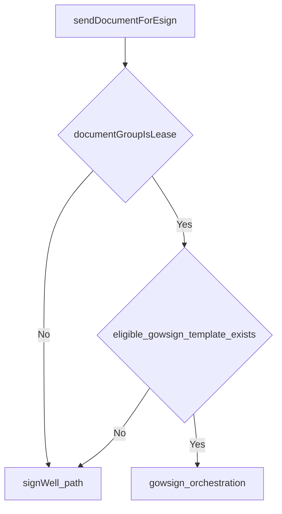

# provider routing and template selection

---
title: Provider Routing and Template Selection
---
## Decision Entry Point

Provider routing for lease e-sign starts in:

- `BE/svc/src/main/java/com/uownleasing/svc/service/esign/EsignService.java`
  - `sendDocumentForEsign(...)`
  - `shouldSendViaGowSign(...)`

## Current Routing Rule

The request routes to GowSign when both are true:

1. `documentGroup == LEASE`
2. `SqlTemplateSelectionService.findForCustomerStateAndClientType(state, clientType)` returns a template

If either condition fails, request follows SignWell/default path.

## Template Eligibility Resolution

Template lookup uses:

- `BE/svc/src/main/java/com/uownleasing/svc/service/gowsign/SqlTemplateSelectionService.java`
- `BE/svc/src/main/java/com/uownleasing/svc/db/repository/GowSignTemplateRepo.java`

### Matching Behavior

- `state` match is required (`UPPER(TRIM(template.state))` == requested state).
- `clientType` may be explicit comma-separated values in template row.
- Blank/null template `clientType` rows are valid fallback for the state.
- Result ordering prefers explicit client-type matches over fallback rows.

## Effective State Context

`EsignService.loadLeadEsignContext(...)` resolves state from customer address, with in-store merchant exceptions as implemented in service logic.

## Merchant Settings Note

Merchant UI/provider settings are no longer the routing source of truth for GowSign vs SignWell selection in this flow. Routing is backend rule-driven and template-availability-driven.

## Testing Impact

Routing validation should always verify:

- request uses `LEASE` group
- effective state value used by backend
- merchant client type used in selector
- matching row exists in `uown_gow_sign_template`

