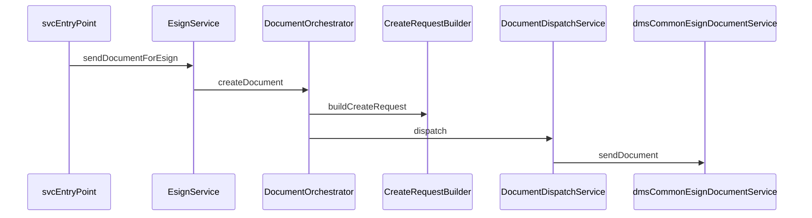

# svc orchestration

---
title: SVC Orchestration
---
## Main Entry Points

Lease e-sign requests that can reach GowSign originate from flows calling:

- `EsignService.sendDocumentForEsign(...)`
- `GowSignDocumentController.createGowSignDocument(...)` (`/uown/svc/gowsign-documents`)

Primary files:

- `BE/svc/src/main/java/com/uownleasing/svc/service/esign/EsignService.java`
- `BE/svc/src/main/java/com/uownleasing/svc/rest/svc/GowSignDocumentController.java`

## Orchestrator Flow

`DocumentOrchestrator.createDocument(...)` coordinates:

1. Load lead/customer/merchant context
2. Resolve template by state + clientType
3. Build scalar variables from SQL mapping service
4. Build table variables:
   - `leaseItems`
   - `earlyPurchaseOption`
   - `leasePurchasePlan`
5. Build provider request object
6. Dispatch to `dms-common`

File:

- `BE/svc/src/main/java/com/uownleasing/svc/service/gowsign/DocumentOrchestrator.java`

## Request Construction Details

`CreateRequestBuilder` responsibilities:

- builds requester identity with fallback from primary customer data
- validates required requester fields (name/email)
- applies template id and variables
- computes expiration date from merchant config
- sets callback environment from `GowSignConfig`
- applies footer template (default if row has none)

File:

- `BE/svc/src/main/java/com/uownleasing/svc/service/gowsign/CreateRequestBuilder.java`

## Dispatch to DMS-Common

`DocumentDispatchService.dispatch(...)`:

- sets `EsignInfo.client = GOWSIGN`
- enforces base URL normalization to include `/api`
- injects API key and sender info from `GowSignConfig`
- logs missing simple template variables as lead notes
- calls `EsignDocumentService.sendDocument(esignInfo)` in `dms-common`

File:

- `BE/svc/src/main/java/com/uownleasing/svc/service/gowsign/DocumentDispatchService.java`

## Sequence Diagram

## Operational Notes

- Routing and template selection happen before payload dispatch.
- Missing template eligibility returns fallback behavior (or service-level exception in direct GowSign endpoint paths).
- Variable contract mismatch risk is reduced by lead-note logging in dispatch service.
