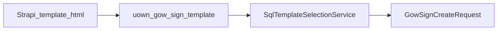

# template registry and strapi authoring

---
title: Template Registry and Strapi Authoring
---
Registry table was created and updated via migrations in `svc`:

- `BE/svc/src/main/resources/db/migration/V20260406044409_1.51.0__create_gowsign_template.sql`
- `BE/svc/src/main/resources/db/migration/V20260505041814_1.51.1__alter_gow_sign_template_client_type_to_text.sql`

Key columns:

- `template_id` (unique provider template id)
- `name` (business/display template name)
- `variables` (raw expected placeholder contract)
- `sender`
- `state`
- `client_type` (nullable, supports comma-separated targeting)
- `footer_template` (optional)

## Template CRUD API in `svc`

Controller:

- `BE/svc/src/main/java/com/uownleasing/svc/rest/svc/GowSignTemplateController.java`

Endpoints:

- `POST /uown/svc/gowsign-templates`
- `GET /uown/svc/gowsign-templates`
- `GET /uown/svc/gowsign-templates/{templateId}`
- `PATCH /uown/svc/gowsign-templates/{templateId}`
- `DELETE /uown/svc/gowsign-templates/{templateId}`

Service validation:

- `templateId`, `name`, `variables`, `sender`, and `state` are required on create/update.
- `clientType` is normalized to uppercase with whitespace removed.

## Strapi Authoring Contract

Main authoring rules:

- Scalar placeholders use `{{variableName}}`.
- Dynamic table placeholders use `[table|tableName]`.
- Signature controls use bracket syntax (`[sig|...]`, `[initials|...]`, `[checkbox|...]`, etc.).
- Variable naming is case-sensitive and must match keys built by `svc`.

## Variable Categories

- Lessee identity and address
- Brand/lessor identity block
- Contract metadata
- Payment and fee fields
- Early purchase option values
- Bank/ACH display values
- Dynamic table payloads (`leaseItems`, `earlyPurchaseOption`, `leasePurchasePlan`)

## Data Linkage Flow

## Governance Recommendations

- Keep template `variables` metadata in sync with code-built payload keys.
- Keep stable field ids for reporting and downstream parsing (for example consent-related fields).
