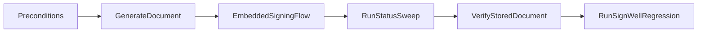

# testing and regression checklist

---
title: Testing and Regression Checklist
---
## Objective

Validate the GowSign end-to-end lease flow and confirm SignWell fallback/regression behavior remains correct after integration or template changes.

## Test Inputs and Preconditions

Before test execution:

- Ensure eligible rows exist in `uown_gow_sign_template` for target state/client type.
- Confirm lead has primary customer, valid email, and valid effective state.
- Confirm test data includes both:
  - GowSign-eligible scenario
  - Non-eligible/fallback scenario

## Recommended Execution Flow

## Scenario Matrix

### A) GowSign Happy Path

- Trigger lease creation where backend should select GowSign.
- Verify response includes:
  - `embeddedSigningUrl`
  - `esignClient = GOWSIGN`
  - `esignIframeOrigin` when provided
- Open embedded modal and complete signing.
- Confirm terminal path updates status and contract final state as expected.

### B) GowSign Closed/Error Paths

- Trigger close-without-signing and error events from embedded flow.
- Verify redirect mapping and persisted status behavior.
- Verify no false positive `SIGNED`/`STORED` status when completion did not happen.

### C) SignWell Fallback Regression

- Execute scenario where GowSign eligibility is intentionally not met.
- Verify `esignClient = SIGNWELL`.
- Confirm SignWell embedded behavior and final status mapping remain intact.

### D) Client-Type Template Selection

- Validate separate template rows for targeted client types (for example jewelry variants).
- Generate documents for each client-type scenario.
- Confirm resulting output content aligns to selected template definition.

## DB and Payload Validation

For each executed scenario, validate:

- provider/client field values in persisted e-sign document row
- create request payload shape (requester/template/variables)
- response payload persistence (`documentKey`, embed URL, status)
- callback field capture and field-value normalization behavior
- completed PDF retrieval and document availability on lead/customer side

## Completion Criteria

A release candidate is test-complete when:

- all GowSign happy-path checks pass
- closed/error branches behave as expected
- SignWell fallback regression passes
- template-selection cases pass for configured client types
- persisted statuses and stored signed-doc outcomes are consistent with runtime events
